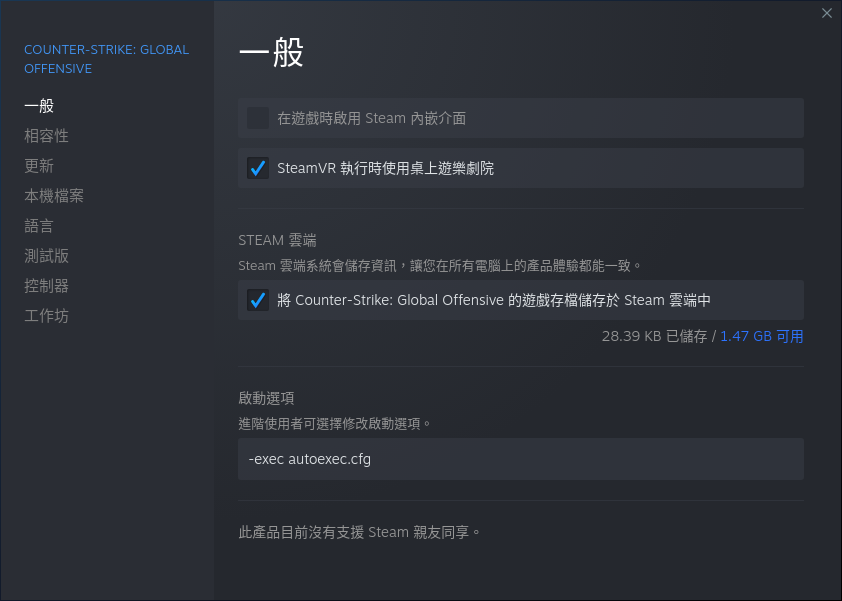

# CS:GO cfgs

## 下載

進入 CS:GO cfg 資料夾

```
$ cd "$HOME/.steam/steam/steamapps/common/Counter-Strike Global Offensive/csgo/cfg"
```

下載練習投擲物 cfg

```
$ wget "https://raw.githubusercontent.com/Yooootsuba/csgo-cfgs/master/main.cfg"
```

下載跳丟投擲物 cfg

```
$ wget "https://raw.githubusercontent.com/Yooootsuba/csgo-cfgs/master/autoexec.cfg"
```

## 跳丟投擲物

MOUSE4 為滑鼠側鍵，可以自行修改跳丟投擲物要綁定的熱鍵

```
// 跳丟
alias "+jumpthrow" "+jump; -attack"
alias "-jumpthrow" "-jump"
bind  "MOUSE4"     "+jumpthrow"
```

需要在啟動選項新增

```
-exec autoexec.cfg
```


